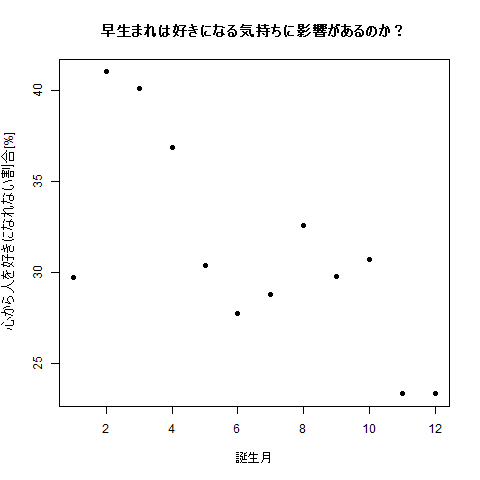

心から人を好きになれない星座ランキングに対する生まれ月の関係
====

Overview
「月曜から夜ふかし」、面白いですよね。
2018年11月19日放送分の録画をみて、気になるランキングが発表されていました。


早生まれの星座が「心の底から好きになった人がいない」の上位にきている・・・・？

以前、TokyoR勉強会で知り合った方から、「早生まれと子どもの発達には関係が深い」と聞いたこともあり、
この直感がどの程度確からしいのか調べてみました。

さっそく、星座ごとの割合を誕生月の順番に並べてプロットしてみました。


どうやら、直感、正しいかもしれません！
下のほうでだいたい統計的に本当に「早生まれだと顕著に人を好きにならない」といっていいのか確認しました。
統計解析の結果、わりと間違ったことはを言ってないみたいです！

もしかしたら、「人を好きになること」は幼少期のころの自己肯定感と関係があるのかもな～っと思いました。
そうやってみると、意外と相対年齢効果は高いのかもしれませんね。

ちょっとした疑問でしたが、サクッとそれらしい結果が出たのでついまとめてみちゃいました。
ぼちぼち、自分が勉強してきたことをまとめてみるいい機会になりました。


## 統計解析手法
### ① データの整理
星座は前月20日ごろ-各月20日ごろを範囲としているため、月の区切りがずれてしまっている。
今回は学年の区切りが月単位なので、以下の式で月単位で評価にするための変換をした。
```math
ある月での「心の底から好きになった人がいない」割合 like_parallel[%] = その月の星座での割合[%] *20日/30日 + 前月の星座での割合[%] *10日/30日 
```

```math
v=read.csv("./data.csv",header=T)
```

|日本名 |star |month |like_population |like_parallel |born|
|---|:-:|:-:|:-:|:-:|:-:|
|牡羊座 |Aries |4 |36.6 |36.83333333 |75528|
|牡牛座 |Taurus |5 |27.3 |30.4 |71898|
|双子座 |Gemini |6 |28 |27.76666667 |78471|
|蟹座 |Cancer |7 |29.2 |28.8 |75255|
|獅子座 |Leo |8 |34.3 |32.6 |80890|
|乙女座 |Virgo |9 |27.5 |29.76666667 |77035|
|天秤座 |Libra |10 |32.3 |30.7 |80315|
|蠍座 |Scorpius |11 |18.9 |23.36666667 |83040|
|射手座 |Sagittarius |12 |25.6 |23.36666667 |81680|
|山羊座 |Capricornus |1 |31.8 |29.73333333 |81526|
|水瓶座 |Aquarius |2 |45.6 |41 |77559|
|魚座 |Pisces |3 |37.3 |40.06666667 |82863|


### ② 「心の底から好きになった人がいない」星座の割合が明らかに偏っていることの確認
人口に占める各誕生月の割合と比較した。人口に占める各誕生月は、手短に29年度に生まれた出生数で代用した。

全体に占める各月の生まれた割合からどのくらい「心の底から好きになった人がいない」星座の割合が外れているかを、Χ二乗検定で評価した。

```math
v%>%{chisq.test(.$like_parallel*1038/100,p=.$born/.$born%>%sum)}
        Chi-squared test for given probabilities

data:  v$like_parallel * 1038/100
X-squared = 131.73, df = 11, p-value < 2.2e-16
```

「心の底から好きになった人がいない」割合には、人口の割合では説明できない偏りがあることがわかった。


### ③　年間を通して、2月をピークに、12月まで減少傾向があることの確認
ここでは、簡便に時間軸に対して1月→12月での減少傾向を確認した。(1-3月を早生まれ、それ以外を通常の生まれとするならば、1月→12月で減少する様子が観察されるため)
ついでに、あまり影響がなかったが、各月の出生数での影響を補正しておいた。

monthは「心の底から好きになった人がいない」割合に対して統計学的有意に説明することがわかった。

```math
lm(like_parallel~born+month,v)%>%summary

Call:
lm(formula = like_parallel ~ born + month, data = v2)

Residuals:
    Min      1Q  Median      3Q     Max 
-7.7159 -2.4981 -0.1243  3.1556  4.8563 

Coefficients:
              Estimate Std. Error t value Pr(>|t|)  
(Intercept) 37.3961244 30.3789806   1.231    0.250  
born         0.0000145  0.0003911   0.037    0.971  
month       -1.1291438  0.3764965  -2.999    0.015 *
---
Signif. codes:  0 ‘***’ 0.001 ‘**’ 0.01 ‘*’ 0.05 ‘.’ 0.1 ‘ ’ 1

Residual standard error: 4.377 on 9 degrees of freedom
Multiple R-squared:  0.5125,    Adjusted R-squared:  0.4042 
F-statistic: 4.731 on 2 and 9 DF,  p-value: 0.03942
```


## 出典
[2015年度学生懸賞論文（学部学生の部）第一席受賞 生まれ月が小中学生の学習・運動習慣に与える影響]:(https://www.waseda.jp/fcom/soc/assets/uploads/2016/11/wcom447-448_03.pdf)
[12星座ランキング！　「心の底から好きになった人がいない」と思う星座とは]:(https://sirabee.com/2018/11/03/20161847984/)
[厚生労働省　人口動態統計月報（概数）　平成２９年１２月分（年計を含む）]:(https://www.mhlw.go.jp/toukei/saikin/hw/jinkou/geppo/m2017/dl/all2912.pdf)


## Author
[SUMi41](https://github.com/SUMi41)
